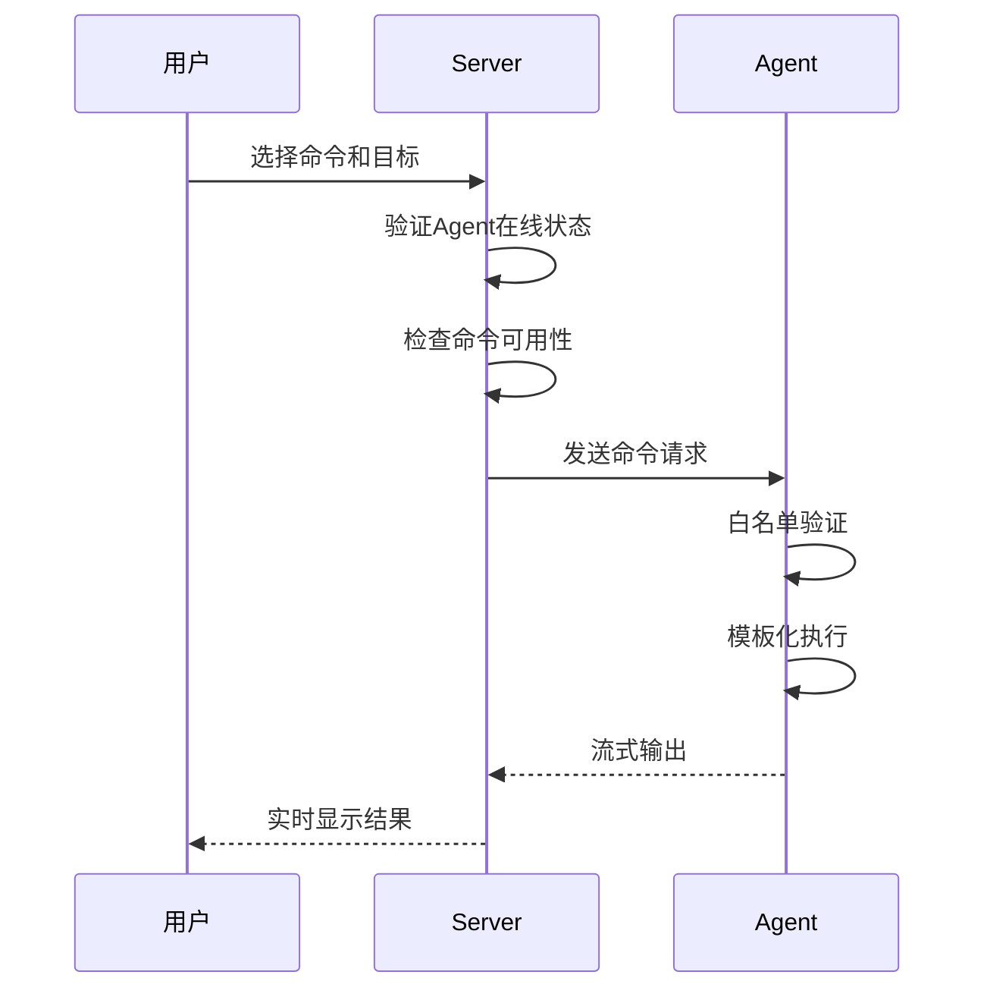

# YALS - Yet Another Looking Glass

YALS是一个现代化的分布式Looking Glass系统，采用WebSocket架构实现server与agent之间的实时通信。系统支持agent主动连接server，提供高可用性和自动重连功能，让用户通过Web界面在全球分布的节点上执行网络诊断命令。

## 🚀 项目功能特点

- **🔄 反向连接架构**: Agent主动连接Server，支持NAT和防火墙环境
- **🔐 安全认证**: 基于密码的WebSocket认证，支持TLS/WSS加密连接
- **📡 实时通信**: WebSocket双向通信，支持命令流式输出和实时停止
- **🎯 智能重连**: Agent断线自动重连，Server端保留历史连接信息
- **🌐 多协议支持**: 自动检测ws/wss协议，支持反向代理和CDN
- **📊 状态管理**: 实时显示agent在线/离线状态，支持历史连接记录
- **🛡️ 命令白名单**: Agent端定义允许执行的命令，防止远程代码执行
- **🎨 响应式界面**: 现代化Web界面，支持移动端访问
- **⚡ 高性能**: 支持并发命令执行，智能排序和分组显示
- **🔧 灵活配置**: 支持自定义web目录、离线清理策略等高级配置

## 🌍 实战案例

  [Sharon Networks](https://lg.sharon.io)
  
  [LeiKwan Host](https://routing.leikwanhost.com/)

  [Gomami Networks](https://lg.gomami.io)

## ⚡ 快速入门

### 快速部署Server（Linux）

```bash
bash <(curl -sL https://mirror.autec.my/yals/install_server.sh) \
  --server-host 172.18.0.1 \
  --server-port 1867 \
  --server-password "your_password"
```

### 快速部署Agent

```bash
bash <(curl -sL https://mirror.autec.my/yals/install_agent.sh) \
  --server-host lg.example.com \
  --server-port 443 \
  --server-password "your_password" \
  --server-tls true \
  --agent-name "Node 1" \
  --agent-group "Location A" \
  --location "Earth" \
  --datacenter "DEEPDARK 1" \
  --test-ip "11.4.5.14" \
  --description "Your node info"
```

### 更新Server/Agent

```bash
# 更新Server
bash <(curl -sL https://mirror.autec.my/yals/install_server.sh) update

# 更新Agent
bash <(curl -sL https://mirror.autec.my/yals/install_agent.sh) update
```

## 📋 系统要求

### Server端

- **操作系统**: Windows / Linux 
- **网络**: 支持入站连接的公网IP或域名
- **端口**: 可配置端口（默认8080），支持反向代理

### Agent端

- **操作系统**: Linux (推荐 Debian 12+)
- **网络**: 能够访问Server的出站网络连接
- **工具**: ping, mtr, nexttrace (快速入门脚本默认配置命令，需自行提前安装)

## 🛠️ 手动安装指南

### 编译部署

1. **编译程序**：
```bash
# 克隆项目
git clone https://github.com/TogawaSakiko363/YALS.git
cd yals

# Windows环境编译
./build_binaries.bat

# Linux/macOS环境编译
go build -o yals_server ./cmd/server/main.go
go build -o yals_agent ./cmd/agent/main.go
```

### Server端部署

1. **创建配置文件** (`config.yaml`)：
```yaml
# 应用设置
app:
  version: "3.0.0-rc3"

# 服务器设置
server:
  host: "0.0.0.0"      # 监听地址
  port: 8080           # 监听端口
  password: "abc123"   # Agent连接密码
  log_level: "info"

# WebSocket设置
websocket:
  ping_interval: 30    # 心跳间隔(秒)
  pong_wait: 60        # 心跳超时(秒)

# 连接设置
connection:
  timeout: 10
  keepalive: 30
  retry_interval: 15
  max_retries: 0
  delete_offline_agents: 86400  # 24小时后清理离线agent
```

2. **启动Server**：
```bash
# 使用默认配置
./yals_server

# 指定配置文件和web目录
./yals_server -c config.yaml -w ./web
```

### Agent端部署

1. **创建配置文件** (`agent.yaml`)：
```yaml
# 服务器连接信息
server:
  host: "lg.example.com"    # Server地址
  port: 443                 # Server端口
  password: "abc123"        # 连接密码
  tls: true                 # 推荐使用WSS加密连接

# Agent信息
agent:
  name: "Node 1"           # Agent名称
  group: "Location A"      # 分组名称
  details:
    location: "Tokyo, JP"
    datacenter: "DC1"
    test_ip: "1.2.3.4"
    description: "测试节点"

# 命令白名单
commands:
  ping:
    template: "ping -c 4"
    description: "网络连通性测试"
  mtr:
    template: "mtr -rw -c 4"
    description: "网络路由和丢包分析"
  nexttrace:
    template: "nexttrace --nocolor --map --ipv4"
    description: "可视化路由跟踪"
```

2. **启动Agent**：
```bash
# 使用配置文件启动
./yals_agent -c agent.yaml
```

### 🔧 高级配置

#### 系统服务配置
```bash
# 创建systemd服务文件
sudo tee /etc/systemd/system/yals-server.service > /dev/null <<EOF
[Unit]
Description=YALS Server
After=network.target

[Service]
Type=simple
User=yals
WorkingDirectory=/opt/yals
ExecStart=/opt/yals/yals_server -c /opt/yals/config.yaml -w /opt/yals/web
Restart=always
RestartSec=5

[Install]
WantedBy=multi-user.target
EOF

# 启用并启动服务
sudo systemctl enable yals-server
sudo systemctl start yals-server
```

## 🔐 安全架构

### 现代化安全设计

YALS 3.0+ 采用反向连接架构和多层安全机制，确保系统安全性：

#### 🛡️ 核心安全特性
- **🔄 反向连接**: Agent主动连接Server，无需开放Agent端口
- **🔐 密码认证**: WebSocket连接基于密码认证
- **🔒 TLS加密**: 支持WSS加密传输，防止中间人攻击
- **📝 命令白名单**: Agent端严格控制可执行命令
- **🎯 模板化执行**: 预定义命令模板，防止命令注入
- **💓 心跳检测**: 30秒心跳包，及时发现连接异常
- **🌐 代理支持**: 支持反向代理，获取真实客户端IP

#### 🔄 架构演进对比

| 特性 | 旧架构 (SSH) | 新架构 (WebSocket) |
|------|-------------|-------------------|
| 连接方向 | Server → Agent | Agent → Server |
| 端口要求 | Agent需开放端口 | 仅Server需开放端口 |
| 防火墙友好 | ❌ 需配置入站规则 | ✅ 仅需出站连接 |
| 命令控制 | Server端定义 | Agent端白名单 |
| 安全风险 | 🔴 远程代码执行 | 🟢 命令白名单保护 |
| 实时性 | ❌ 批量执行 | ✅ 流式输出 |
| 重连机制 | ❌ 手动重连 | ✅ 自动重连 |

### 🔒 安全机制详解

#### 1. 多层认证体系
```
┌─────────────┐    密码认证    ┌─────────────┐
│   Agent     │ ──────────────► │   Server    │
│             │    WSS/TLS     │             │
└─────────────┘                └─────────────┘
```

#### 2. 命令执行安全链
```
用户请求 → Server验证 → Agent白名单检查 → 模板执行 → 结果返回
```

#### 3. 网络安全特性
- **🔐 TLS加密**: 支持WSS协议，数据传输加密
- **🌐 代理友好**: 支持X-Real-IP和X-Forwarded-For
- **💓 连接监控**: 心跳检测，异常连接自动断开
- **🚫 访问控制**: 基于密码的连接认证

#### 4. 运行时安全
- **📝 命令审计**: 所有命令执行都有日志记录
- **⏱️ 超时保护**: 命令执行超时自动终止
- **🔄 状态隔离**: 每个Agent独立运行，互不影响

### 🚀 命令执行流程



### 安全最佳实践

#### 1. 密码安全
- 使用强密码（至少 12 位，包含大小写字母、数字、特殊字符）
- 定期更换密码

#### 2. 网络安全
- 在内网环境中部署
- 使用防火墙限制访问
- 考虑使用 VPN 或专用网络

#### 3. 命令限制
- 只添加必要的命令到白名单
- 定期审查命令列表
- 避免添加危险命令（如 rm、dd 等）

#### 4. 监控和日志
- 监控 Agent 连接状态
- 记录命令执行日志
- 设置异常告警

## 🔧 故障排除

### 常见问题解决

#### Agent连接问题
```bash
# 1. 检查网络连通性
curl -I http://your-server:8080

# 2. 验证TLS配置
openssl s_client -connect your-server:443 -servername your-domain

# 3. 检查Agent日志
journalctl -u yals-agent -f

# 4. 验证密码配置
grep -r "password" config.yaml agent.yaml
```

#### 命令执行问题
```bash
# 1. 检查命令白名单
./yals_agent -c agent.yaml --list-commands

# 2. 测试命令权限
sudo -u yals ping -c 1 8.8.8.8

# 3. 检查命令路径
which ping mtr nexttrace

# 4. 验证Agent状态
systemctl status yals-agent
```

#### 性能优化
```bash
# 1. 调整心跳间隔
# config.yaml中修改ping_interval

# 2. 优化清理策略  
# 设置delete_offline_agents参数

# 3. 监控资源使用
htop
netstat -tulpn | grep yals
```

## 🚀 高级功能

### 反向代理配置

#### Nginx配置
```nginx
server {
    listen 443 ssl http2;
    server_name lg.example.com;
    
    # SSL配置
    ssl_certificate /path/to/cert.pem;
    ssl_certificate_key /path/to/key.pem;
    
    # WebSocket代理
    location /ws {
        proxy_pass http://127.0.0.1:8080;
        proxy_http_version 1.1;
        proxy_set_header Upgrade $http_upgrade;
        proxy_set_header Connection "upgrade";
        proxy_set_header X-Real-IP $remote_addr;
        proxy_set_header X-Forwarded-For $proxy_add_x_forwarded_for;
        proxy_set_header Host $host;
    }
    
    # 静态文件
    location / {
        proxy_pass http://127.0.0.1:8080;
        proxy_set_header X-Real-IP $remote_addr;
        proxy_set_header X-Forwarded-For $proxy_add_x_forwarded_for;
        proxy_set_header Host $host;
    }
}
```

## 前端构建说明

### 安装依赖

```bash
cd frontend
npm install
```

### 自定义网页标题和Logo

自从2.2.3版本起，可在前端目录下的 `src/custom.tsx` 快速实现有限的个性化Looking Glass

```
// 网页自定义配置文件
export const config = {
  // 网页标题
  pageTitle: 'Example Networks, LLC. - Looking Glass',
  
  // 右侧页脚文字内容
  footerRightText: '© 2025 Example Networks, LLC.',
  
  // 网页icon图标路径
  faviconPath: '/images/favicon.ico',
  
  // 网页左上角logo图标路径
  logoPath: '/images/Example.svg',
  
  // 网页背景颜色
  backgroundColor: '#f5f4f1'
};

// 导出类型定义，方便TypeScript类型检查
export type ConfigType = typeof config;
```

### 构建前端

执行构建命令：

```bash
npm run build
```

## 🎯 使用方法

### Web界面操作

1. **访问界面**: 浏览器打开 `http://your-server:8080`
2. **选择节点**: 左侧面板选择在线的Agent节点
3. **选择命令**: 选择要执行的网络诊断命令
4. **输入目标**: 输入目标IP地址或域名
5. **执行命令**: 点击执行按钮开始测试
6. **查看结果**: 实时查看命令输出和执行状态
7. **停止命令**: 可随时点击停止按钮终止执行

### 🎨 界面特性

- **📱 响应式设计**: 支持桌面和移动设备
- **🔄 实时更新**: Agent状态和命令输出实时刷新
- **📊 智能排序**: Agent按字母顺序固定排列
- **🏷️ 分组显示**: 按地理位置或用途分组
- **⏹️ 命令控制**: 支持命令停止和重新执行
- **📋 结果复制**: 一键复制命令输出结果

## 📄 许可证

本项目采用 [MIT License](LICENSE.md) 开源协议。